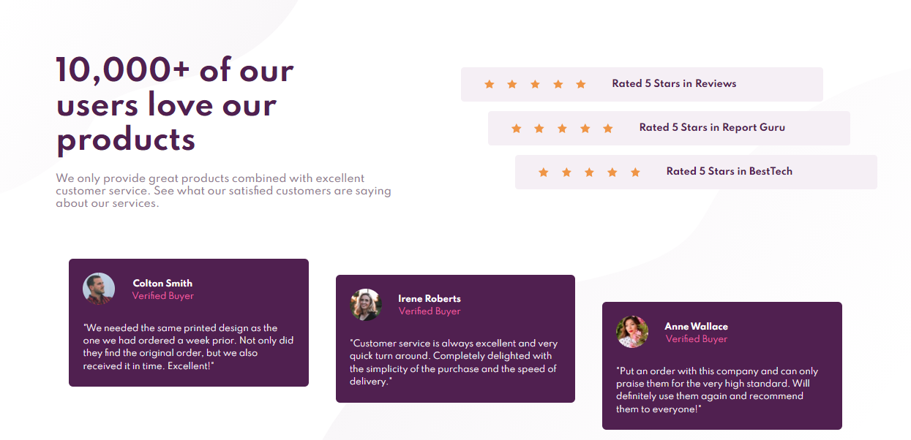

# Frontend Mentor - Social proof section component solution

This is a solution to the [Social proof section](https://www.frontendmentor.io/challenges/social-proof-section-6e0qTv_bA). Frontend Mentor challenges help you improve your coding skills by building realistic projects. 

> **Note:** in order to avoid large names, the URL of this project is an abbreviation of the name of this repository (social-proof-section-sass -> spss) with its unique ID (for less problems with names already taken).

## Screenshot

## Links

- [Frontend Mentor](https://www.frontendmentor.io/solutions/social-proof-section-using-smacss-kB1daTm4Q)
- [Netlify](https://spss-7c99df.netlify.app/)

## Author

- Frontend Mentor - [@said-alrove](https://www.frontendmentor.io/profile/said-alrove)
- Twitter - [@said_alrove](https://twitter.com/said_alrove)